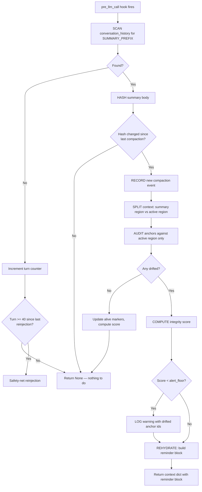

# MemLock — Re-assert standing instructions after context compaction

MemLock detects Hermes context compactions, audits which pinned instructions
(anchors) survived in the active (non-summary) region of the conversation,
and rehydrates casualty reminders before they drift out of the model's working
memory.

---

## 60-second Quickstart

```bash
# Clone into Hermes plugins directory
git clone https://github.com/Sahil-SS9/hermes-memlock.git ~/.hermes/plugins/memlock

# Enable in ~/.hermes/config.yaml:
plugins:
  enabled:
    - memlock

# Pin an instruction (ask the model to call guard_pin):
"As a standing instruction use the guard_pin tool with text='Always reply in bullet points' priority=80"

# Check status:
/guard

# Pin and then send a long message that triggers compaction —
# the pin survives. That's the whole demo.
```

---

## Why this exists

Hermes context compression wraps compacted turns in:

```
[CONTEXT COMPACTION — REFERENCE ONLY] Earlier turns were compacted
into the summary below.
```

That `SUMMARY_PREFIX` marker is a behavioural signal: the model treats
everything below it as **background reference**, not active instructions.
Any pinned standing instruction (output format, tool preference, writing
style) sitting inside the summary region is demoted to reference-only.

MemLock solves this. The `pre_llm_call` hook detects the compaction marker,
hashes the summary body, and audits the **active** (non-summary) region for
your pinned anchors. Drifted anchors get rehydrated as a reminder block
appended to the current user turn.

---

## How it works

### Compaction detection flow



### Anchor lifecycle


---

## Configuration

| Key | Default | Description |
|---|---|---|
| `detection` | `keyword` | `keyword` or `semantic` (P3, requires sentence-transformers) |
| `drift_threshold` | `0.5` | Fraction of probes that must hit in active region |
| `sim_threshold` | `0.65` | Cosine similarity threshold for semantic mode |
| `max_slots` | `8` | Max anchors rehydrated per turn |
| `max_reminder_chars` | `600` | Total reminder block char limit |
| `hard_reinject_turns` | `40` | Safety net: reinject top anchors even without drift |
| `alert_floor` | `70` | Integrity score % below which a warning is logged |
| `alert_cooldown_s` | `1800` | Min seconds between alerts (prevents spam) |
| `embedding_model` | `all-MiniLM-L6-v2` | Sentence-transformer for semantic mode |

---

## Slash Commands

| Command | Description |
|---|---|
| `/guard` | Show integrity score, anchor list, drift log |

## Tool: `guard_pin`

Pin or unpin a standing instruction.

| Param | Required | Description |
|---|---|---|
| `text` | For pin | The instruction to preserve |
| `priority` | No | 1-100 (default 50). Higher values get rehydrated first |
| `reminder` | No | Short version for re-insertion (auto-trimmed) |
| `probes` | No | Distinctive keywords for drift detection (auto-derived) |
| `unpin` | For unpin | Anchor id to remove |

## Limitations

- Probe-based detection is best-effort. Auto-derived probes may be
  imprecise for short or generic instructions. Define explicit `probes`
  in your anchor config for critical instructions.
- The `session_id` binding uses the Hermes dispatch-layer forwarding when
  available. On vanilla Hermes (without the optional dispatch patch),
  tool handlers bind to the last-seen session — correct for single-session
  environments, but a documented race under concurrent gateway sessions.
  See `docs/optional-dispatch-patch.md` for the 3-line fix.
- Semantic mode (sentence-transformers) requires installing the additional
  `sentence-transformers` package. Disabled by default.

## License

MIT — see `LICENSE`.
