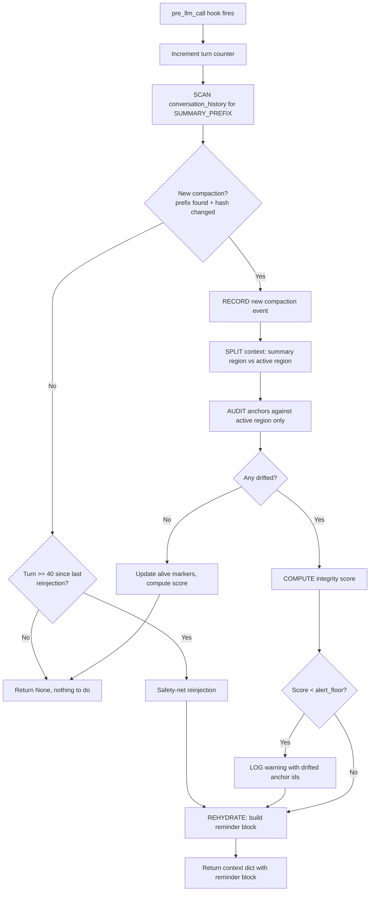
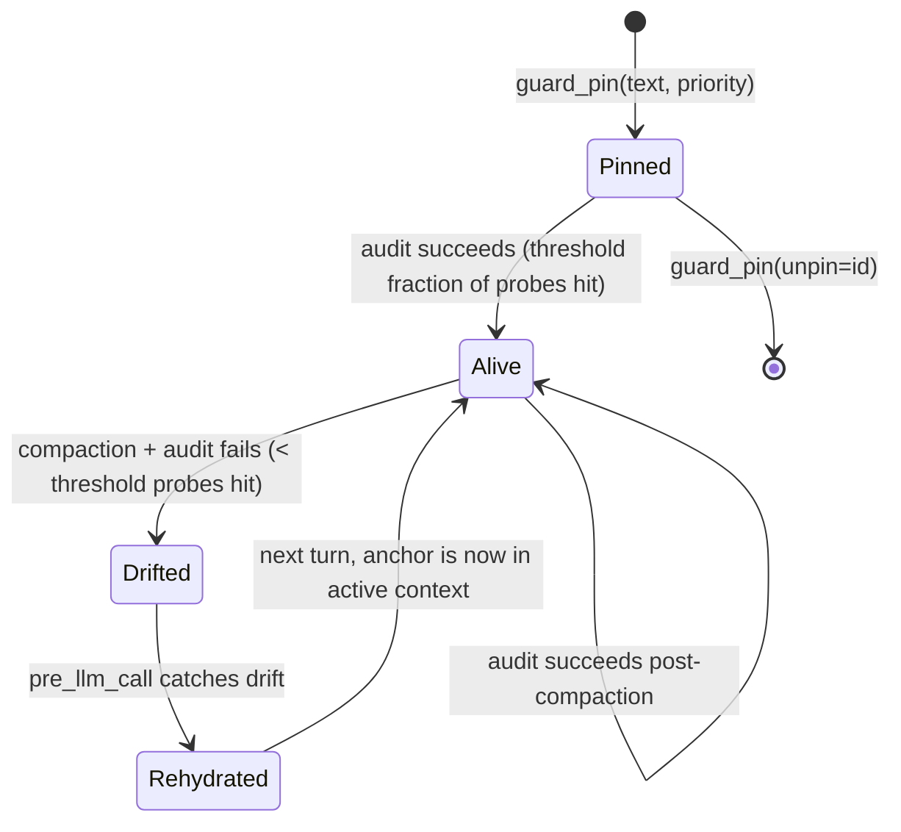

# MemLock: re-assert standing instructions after context compaction

MemLock detects Hermes context compactions, audits which pinned instructions
(anchors) survived in the active (non-summary) region of the conversation,
and rehydrates the casualties as a reminder block before they drift out of
the model's working memory.

---

## 60-second Quickstart

```bash
# Clone into Hermes plugins directory
git clone https://github.com/Sahil-SS9/hermes-memlock.git ~/.hermes/plugins/memlock

# Enable in ~/.hermes/config.yaml:
plugins:
  enabled:
    - memlock

# Pin an instruction (ask the model to call guard_pin):
"As a standing instruction use the guard_pin tool with text='Always reply in bullet points' priority=80"

# Check status:
/guard

# Pin and then send a long message that triggers compaction;
# the pin survives. That's the whole demo.
```

---

## Why this exists

Hermes context compression wraps compacted turns in:

```
[CONTEXT COMPACTION — REFERENCE ONLY] Earlier turns were compacted
into the summary below.
```

That `SUMMARY_PREFIX` marker is a behavioural signal: the model treats
everything below it as **background reference**, not active instructions.
Any standing instruction (output format, tool preference, writing style)
sitting inside the summary region is demoted to reference-only. The
instruction is still physically in the context window; the model just no
longer obeys it. This failure mode is well documented across agent
frameworks (see Prior art below), and instruction decay over long
conversations is measurable: Li et al. (COLM 2024) quantify instruction
instability in long dialogues, and Chroma's Context Rot study shows
performance degrading with input length across 18 models.

MemLock's `pre_llm_call` hook detects the compaction marker, hashes the
summary body, and audits the **active** (non-summary) region for your pinned
anchors. Drifted anchors get rehydrated as a reminder block appended to the
current user turn.

## Prior art

The detect-and-reinject idea is not new; the audit step is the difference.

- [post_compact_reminder](https://github.com/Dicklesworthstone/post_compact_reminder)
  detects Claude Code compactions and reinjects a reminder unconditionally.
- [openclaw-sticky-context](https://github.com/jamebobob/openclaw-sticky-context)
  pinned context into the system prompt every turn, where compaction cannot
  touch it.
- [Letta (MemGPT) memory blocks](https://docs.letta.com/guides/core-concepts/memory/memory-blocks)
  pin content structurally: core memory is architecturally exempt from
  summarisation.
- Claude Code re-reads CLAUDE.md from disk after compaction
  ([memory docs](https://code.claude.com/docs/en/memory)).

MemLock differs in the middle step: it audits whether each anchor actually
survived in the active region (keyword probes, or windowed embedding
similarity) and reinjects **only the casualties**. Blanket reinjection costs
tokens every turn and invalidates prompt caches; structural pinning needs
control of the system prompt, which a plugin does not have.

## Design rationale: why not just inject every turn?

That is a legitimate strategy, and MemLock supports it (`inject: always`).
The trade-offs:

| | `on-drift` (default) | `always` |
|---|---|---|
| Token cost | Zero on quiet turns | Reminder block every turn |
| Prompt cache | Stable between compactions | Block participates in every prompt |
| Guarantee | Heuristic (probe quality matters) | Deterministic presence |
| Failure mode | Imprecise probes miss a drift | Instruction fatigue, larger prompts |

Presence is not the same as obedience: re-sending an instruction restores it
to the active region but attention decay is only partially fixed by
repetition (Li et al., COLM 2024). The audit-then-rehydrate default treats
re-injection as a repair action rather than wallpaper; `always` is there for
sessions where determinism matters more than token cost.

Citations: [Measuring and Controlling Instruction (In)Stability in LLM
Dialogs (COLM 2024)](https://arxiv.org/pdf/2402.10962), [Chroma: Context
Rot](https://www.trychroma.com/research/context-rot).

---

## How it works

### Compaction detection flow



With `inject: always`, the rehydrate step runs every turn regardless of the
audit outcome; the audit still runs on compactions to keep the `/guard`
integrity score honest.

### Anchor lifecycle



### Semantic mode

`detection: semantic` replaces keyword probes with embedding similarity.
The active region is split into windows (one per message; long messages are
chunked with overlap), all windows are embedded in one batch, and an anchor
counts as alive if its **maximum** cosine similarity over the windows
reaches `sim_threshold`. A single whole-region embedding would wash short
instructions out by averaging; per-window max similarity is what makes the
comparison meaningful. Requires the optional `sentence-transformers`
package; if it is missing or fails to load, MemLock falls back to keyword
probes. Note the model downloads lazily on first semantic audit.

---

## Configuration

| Key | Default | Description |
|---|---|---|
| `detection` | `keyword` | `keyword` or `semantic` (needs sentence-transformers) |
| `inject` | `on-drift` | `on-drift` (audit-gated) or `always` (every turn) |
| `drift_threshold` | `0.5` | Fraction of probes that must hit in active region |
| `sim_threshold` | `0.65` | Max-cosine threshold for semantic mode |
| `semantic_window_chars` | `1000` | Embedding window size (clamped to a sane floor) |
| `max_slots` | `8` | Max anchors rehydrated per turn |
| `max_reminder_chars` | `600` | Total reminder block char limit |
| `max_pins` | `16` | Cap on guard_pin anchors per session |
| `hard_reinject_turns` | `40` | Safety net: reinject top anchors even without drift |
| `alert_floor` | `70` | Integrity score % below which a warning is logged |
| `alert_cooldown_s` | `1800` | Min seconds between alerts (prevents spam) |
| `alert_script` | `""` | Optional script invoked with the alert message |
| `embedding_model` | `all-MiniLM-L6-v2` | Sentence-transformer for semantic mode |
| `anchors` | `[]` | Static anchors seeded from config |

---

## Slash Commands

| Command | Description |
|---|---|
| `/guard` | Show integrity score, anchor list, drift log |

## Tool: `guard_pin`

Pin or unpin a standing instruction.

| Param | Required | Description |
|---|---|---|
| `text` | For pin | The instruction to preserve |
| `priority` | No | 1-100 (default 50). Higher values get rehydrated first |
| `reminder` | No | Short version for re-insertion (auto-trimmed) |
| `probes` | No | Distinctive keywords for drift detection (auto-derived) |
| `scope` | No | `session` (default, dies with session) or `global` (persists across sessions) |
| `unpin` | For unpin | Anchor id to remove |

### Cross-session persistence

Pins with `scope: global` are saved to a durable store and automatically
re-seeded on every new session. The default backend is a zero-dependency
filesystem store (`~/.hermes/memlock/persist/`). The backend is pluggable:
set `persistence_backend` in config to swap in Mnemosyne or other stores.

```python
# Pin a global instruction that survives session restarts:
guard_pin(text="Always use British English", scope="global", priority=80)

# Session-scoped pins (default) die with the session:
guard_pin(text="For this PR review, use bullet points")
```

## Limitations

- Probe-based detection is best-effort. Auto-derived probes may be
  imprecise for short or generic instructions. Define explicit `probes`
  for critical instructions.
- `guard_pin` is model-callable. A prompt-injected model could pin an
  attacker's instruction, which MemLock would then faithfully re-assert.
  Mitigations: pinned text is whitespace-flattened (no reminder-block
  spoofing), pins are capped per session (`max_pins`), and `/guard` lists
  every active anchor for review. Audit `/guard` after processing
  untrusted content.
- The `session_id` binding uses the Hermes dispatch-layer forwarding when
  available. On vanilla Hermes (without the optional dispatch patch),
  tool handlers bind to the last-seen session: correct for single-session
  environments, but a documented race under concurrent gateway sessions.
  See `docs/optional-dispatch-patch.md` for the 3-line fix.
- Semantic mode needs the optional `sentence-transformers` package and
  downloads the embedding model on first use.

## License

MIT, see `LICENSE`.
